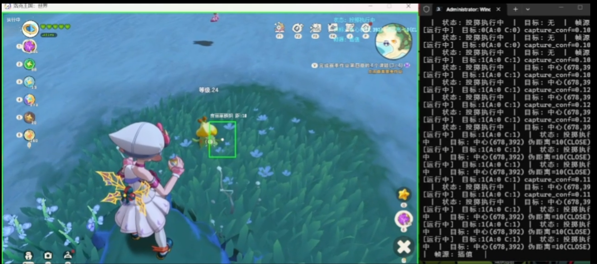

# 洛克王国 — 半自动精灵捕捉工具

专注于一件事：用户走到精灵刷新点，工具自动完成小范围内的精灵识别、靠近、瞄准、投掷。

2026/5/2
通过计算机识别来识别目标完成捕捉，效率太慢，远不及人工。并且维护困难，每只精灵都要训练来认识，工作流大，效率低。故放弃不在维护。附带一个已经训练好的奇异草模型。   

[](https://github.com/lanzeweie/LuoKeWangGuo/blob/master/预览.mp4?raw=true)
点击图片跳转视频

需要安装Interception驱动  
[Interception驱动](https://github.com/oblitum/Interception)   

快速测试(使用uv)     
uv sync   
uv run python .\src\main.py --model .\LuoKeWangGuo\models\trained\luoke_pet.pt --fixed-point     

## 核心定位

> **半自动** — 用户负责"走到哪只精灵面前"，工具负责"在精灵旁边完成靠近、瞄准、投掷"。
> 不做自动寻路，不做大范围移动，不做批量捕捉。

## 架构设计

```
src/
├── __init__.py                # Package init
├── main.py                    # 主入口 — AppContext + 主循环
├── logger.py                  # 日志
├── config.py                  # CLI 参数解析 + Config dataclass
├── config/                    # 瞄准行为配置
│   ├── __init__.py           # Package init
│   └── aim_config.py         # Aim configuration
├── core/                      # 核心模块
│   ├── __init__.py           # Package init
│   ├── context.py            # AppContext — 黑板模式
│   ├── game_logic.py         # 游戏逻辑计算（投掷参数、移动方向）
│   ├── state_machine.py      # 状态机 — 状态跳转 + 策略调度
│   └── capabilities/         # 核心能力层
│       ├── aim_algorithms.py # 瞄准算法（补偿/预测/滤波）
│       ├── detection.py      # YOLO 推理
│       ├── detection_overlay.py # YOLO 检测覆盖层（跳帧/跟踪/插值/绘框）
│       ├── detection_worker.py # 检测跳帧调度器
│       ├── interception_sim.py # Interception 驱动级输入（拟人化算法）
│       ├── layered_overlay.py # DWM 透明覆盖层
│       ├── screen_cap.py     # DX12 截屏
│       ├── target_scoring.py # 目标评分 & 优先级
│       ├── target_verifier.py # 目标验证（多周期确认）
│       ├── template_loader.py # 模板配置加载（类封装）
│       └── window_mgr.py     # 窗口管理（客户区坐标）
├── detectors/                 # CV 模板检测器（OpenCV）
│   ├── __init__.py           # Package init
│   ├── config_loader.py      # 配置加载公共函数
│   ├── capture_mode_detector.py # 精灵球捕捉界面检测
│   ├── battle_mode_detector.py # 战斗界面检测
│   └── battle_exit_confirm_detector.py # 战斗逃跑确认框检测
├── actions/                   # 行动层 — 高级动作组合
│   ├── __init__.py           # Package init
│   ├── aim_and_throw.py      # 瞄准 + 投掷执行
│   └── battle_exit.py        # ESC 退出战斗
├── strategies/                # 策略层 — 业务决策
│   ├── __init__.py           # Package init
│   ├── aim_strategy.py       # 瞄准策略
│   ├── base.py               # Action 枚举 + BaseStrategy 抽象类
│   ├── navigation_strategy.py # 导航策略
│   ├── search_strategy.py    # 搜索策略
│   └── search_patterns/      # 搜索模式实现
│       ├── __init__.py       # Package init
│       ├── base_pattern.py   # 基础搜索模式
│       ├── circular_patrol.py # 圆形巡逻模式
│       ├── enhanced_move_controller.py # WASD 移动执行器
│       ├── micro_look.py     # 微调观察模式
│       └── sweep_360.py      # 360 度扫掠模式
├── utils/                     # 工具函数 — 纯数学计算
│   ├── __init__.py           # Package init
│   └── math_utils.py         # 距离、角度、面积
├── components/                # UI 组件层
│   └── coordinate_picker.py  # 相对坐标选择器 GUI
└── tools/                     # 工具模块（GUI / 调试）
    ├── __init__.py           # Package init
    ├── aim_config_editor.py  # 瞄准配置编辑器
    ├── annotate_roi.py       # ROI 标注工具
    ├── check_interception.py # Interception 环境检查
    ├── diagnose_window.py    # 窗口诊断工具
    ├── mask_region_editor.py # 遮蔽区域编辑器
    └── template_captor.py    # 模板截取工具

config/                        # 根级配置目录
    ├── aim_config.json       # 瞄准行为配置文件
    └── templates/            # CV 模板图片
        ├── capture_mode.png  # 精灵球捕捉界面
        ├── battle_mode.png   # 战斗界面
        ├── battle_exit_confirm.png  # 逃跑确认框
        └── templates_config.json  # 模板坐标配置（相对坐标）

tools/                         # 数据准备与训练脚本
    ├── train.py              # 训练脚本
    ├── prepare_dataset.py    # 数据集准备
    ├── extract_frames.py     # 提取视频帧
    ├── convert_labelme_to_yolo.py  # LabelMe 转 YOLO 格式
    └── README.md             # 工具使用说明

data/                          # 数据集目录
    ├── README.md             # 数据集说明
    ├── classes.txt           # 类别名称列表
    ├── dataset.yaml          # YOLO 训练配置文件
    ├── labels.cache          # YOLO label cache
    ├── images/               # 训练图片
    ├── labels/               # 标注文件
    └── xanylabeling_organizer.py  # LabelMe 组织者辅助脚本

tests/                         # 测试套件
    ├── __init__.py           # Package init
    ├── test_aim_and_throw.py                  # 瞄准投掷集成测试
    ├── test_detection_overlay_realtime.py     # 检测覆盖层实时测试
    ├── test_input_auto.py                     # 输入自动化测试
    ├── test_mode_detection.py                 # CV 模式检测测试
    └── test_search_navigation_realtime.py     # 搜索导航实时测试
```

### 分层职责

| 层 | 职责 | 示例 |
|----|------|------|
| **策略层** `strategies/` | 业务决策 —"怎么做" | WASD 走哪边、鼠标怎么瞄、屏幕怎么扫 |
| **行动层** `actions/` | 高级动作 —"执行什么" | WASD 移动、瞄准投掷、ESC 退出 |
| **检测器层** `detectors/` | CV 模板检测 | 精灵球界面、战斗界面、确认框检测 |
| **能力层** `core/capabilities/` | 底层能力 —"能做什么" | YOLO 检测、截屏、输入模拟、目标评分 |
| **工具层** `utils/` | 纯函数 — 数学计算 | 距离、角度、面积 |
| **主入口** `main.py` | 组装 + 循环 + 渲染 | 创建 AppContext，驱动主循环 |

### 调用关系

```
main.py (AppContext + 主循环)
  ▼
state_machine.py (状态跳转 + 策略调度)
  ├── strategies/*.py (返回 Action)
  └── actions/*.py (执行 Action)
       ↓
  core/capabilities/*.py (底层能力)
```

## 状态流转

```
SEARCH → VERIFY → NAVIGATE(可选) → AIM_AND_THROW → WAIT_RESULT
                                                    ├── 精灵消失 → COOLDOWN → SEARCH
                                                    ├── 触发战斗 → BATTLE_STATE → COOLDOWN → SEARCH
                                                    └── 精灵还在 → 继续投掷
```

## 技术栈

| 组件 | 技术 |
|------|------|
| 语言 | Python 3.9+ |
| 检测 | Ultralytics YOLOv8n |
| 截屏 | dxcam (DirectX12) |
| 输入 | Interception 驱动（拟人化算法） |
| CV | OpenCV 模板匹配 |
| 包管理 | uv |
| 平台 | Windows 10/11 |

## 快速开始

### 1. 安装依赖

```bash
# 安装 Python 依赖
uv sync

# 安装 Interception 驱动（需要管理员权限）
pip install interception
```

**Interception 驱动安装说明**：
- 首次使用需要安装 Interception 驱动程序
- 驱动提供驱动级键鼠注入，反检测能力强于 SendInput
- 安装后需要重启系统
- 详见：https://github.com/oblitum/Interception

### 2. 训练模型

详见 [data/README.md](data/README.md) 和 [tools/README.md](tools/README.md)。

**模型文件位置**：
| 阶段 | 路径 | 说明 |
|------|------|------|
| 预训练基座 | `models/base/yolov8n.pt` | YOLO 官方提供 |
| 训练后模型 | `models/trained/luoke_pet.pt` | 当前项目训练好的模型 |

**训练命令**（详细说明见 tools/README.md）：
```bash
# 使用封装脚本训练（推荐）
uv run python tools/train.py

# 直接使用 ultralytics CLI
uv run yolo train data=data/dataset.yaml model=models/base/yolov8n.pt epochs=100 device=0
```

### 3. 运行主程序

> **必须以管理员身份运行终端**，否则 Interception 驱动无法正常工作。

```bash
uv run python -m src.main --model models/trained/luoke_pet.pt
```

### 4. 常用命令

```bash
# 模型验证
uv run yolo val model=models/trained/luoke_pet.pt data=data/dataset.yaml

# 窗口诊断（排查窗口和截图问题）
uv run python -m src.tools.diagnose_window

# 模板截取（获取 CV 模板）
uv run python -m src.tools.template_captor --capture
uv run python -m src.tools.template_captor --battle

# 遮蔽区域编辑器（框选 YOLO 检测时忽略的区域）
uv run python -m src.tools.mask_region_editor

# 瞄准配置编辑器（调整瞄准参数）
uv run python tests/test_aim_and_throw.py --edit-config
# 或直接运行编辑器
uv run python -m src.tools.aim_config_editor

# Interception 环境检查（必须先运行此检查）
uv run python -m src.tools.check_interception

# 测试套件
uv run python -m pytest tests/                  # 运行全部测试
uv run python tests/test_aim_and_throw.py        # 瞄准投掷集成测试
uv run python tests/test_detection_overlay_realtime.py  # 检测覆盖层实时测试
uv run python tests/test_input_auto.py           # 输入自动化测试
uv run python tests/test_mode_detection.py       # CV 模式检测测试
uv run python tests/test_search_navigation_realtime.py  # 搜索导航实时测试
```

## 数据集与训练

项目使用 YOLO 格式数据集，详见：
- [data/README.md](data/README.md) — 数据集格式、目录结构、标注规范
- [tools/README.md](tools/README.md) — 训练脚本、数据准备工具

## 模型性能

- **训练数据**: 64 张标注图片
- **mAP50**: 99.5% | **mAP50-95**: 92%
- **推理速度**: ~2.6ms/frame (RTX 3060 Ti)
- **模型路径**: `models/trained/luoke_pet.pt`

## 核心原则

1. **纯视觉方案** — 不注入游戏内存，反作弊优先
2. **客户区坐标** — 所有操作坐标相对于窗口客户区
3. **Interception 拟人化输入** — 驱动级注入 + 贝塞尔曲线轨迹 + Fitts's Law 变速 + 微颤模拟 + 过冲修复 + 高斯分布随机延迟
4. **暴力捕捉** — 不判断捕捉成功/失败，精灵消失即结束
5. **禁止硬编码坐标** — 所有坐标通过 `RelativeCoordinatePicker` 获取，存为相对坐标

## 瞄准配置

瞄准行为可以通过配置文件 `config/aim_config.json` 进行调整：

### 主要参数说明

| 参数 | 说明 | 默认值 | 调整建议 |
|------|------|--------|----------|
| `aim_duration` | 瞄准持续时间（秒） | 3.0 | 精灵反应慢时可增加 |
| `aim_tolerance` | 瞄准容忍度（像素） | 40 | 值越大越容易"命中" |
| `mouse_to_view_ratio` | 鼠标视角比例 | 1.0 | 根据游戏灵敏度调整 |
| `p_factor` | P 控制因子（0-1） | 0.4 | 值越小越平滑，避免抖动 |
| `check_interval` | 检查间隔（秒） | 0.05 | 值越小反应越快，但占用更多 CPU |
| `max_move_per_check` | 最大单次移动（像素） | 30 | 限制单次移动量避免过冲 |
| `use_compensation` | 启用距离补偿 | true | 近距离可关闭，远距离建议开启 |
| `use_prediction` | 启用动量预测 | true | 移动目标建议开启 |
| `use_smoothing` | 启用平滑滤波 | true | 减少检测抖动 |
| `fine_tune_enabled` | 启用微调 | true | 增加拟人化 |

### 使用配置编辑器

```bash
# 方式 1：通过测试脚本启动配置编辑器
uv run python tests/test_aim_and_throw.py --edit-config

# 方式 2：直接运行配置编辑器
uv run python -m src.tools.aim_config_editor
```

配置编辑器提供交互式界面，可以实时调整各项参数并保存。

### 配置文件位置

- 默认配置文件：`config/aim_config.json`
- 可以通过 `--config` 参数指定其他配置文件：
  ```bash
  uv run python tests/test_aim_and_throw.py --config my_config.json
  ```

## 开发进度

| 阶段 | 状态 | 详情 |
|------|------|------|
| 1. 环境搭建 | 完成 | uv、依赖、数据集 |
| 2. 模型训练 | 完成 | mAP50=99.5% |
| 3. 核心模块 | 完成 | 检测/截屏/移动/投掷/CV/战斗退出 |
| 4. 架构重构 | 完成 | 三层架构：能力层/行动层/策略层 |
| 5. 策略层 | 完成 | AppContext + 搜索/导航/瞄准策略 |
| 6. 检测覆盖层 | 完成 | 跳帧调度/目标跟踪/插值平滑/防闪烁绘框 |
| 7. 整合测试 | 待开始 | 状态机整合 + 端到端流程验证 |

详细计划见 [docs/implementation_plan.md](docs/implementation_plan.md)

## 重要文件

| 文件 | 路径 |
|------|------|
| 训练模型 | `models/trained/luoke_pet.pt` |
| 实现计划 | `docs/implementation_plan.md` |
| 项目上下文 | `.claude/CLAUDE.md` |
| 数据集说明 | `data/README.md` |
| 工具使用说明 | `tools/README.md` |
| CV 模板目录 | `config/templates/` |
| 统一配置文件 | `config/templates/templates_config.json` |
| 瞄准配置文件 | `config/aim_config.json` |
| 遮蔽区域编辑器 | `src/tools/mask_region_editor.py` |
| 瞄准配置编辑器 | `src/tools/aim_config_editor.py` |
